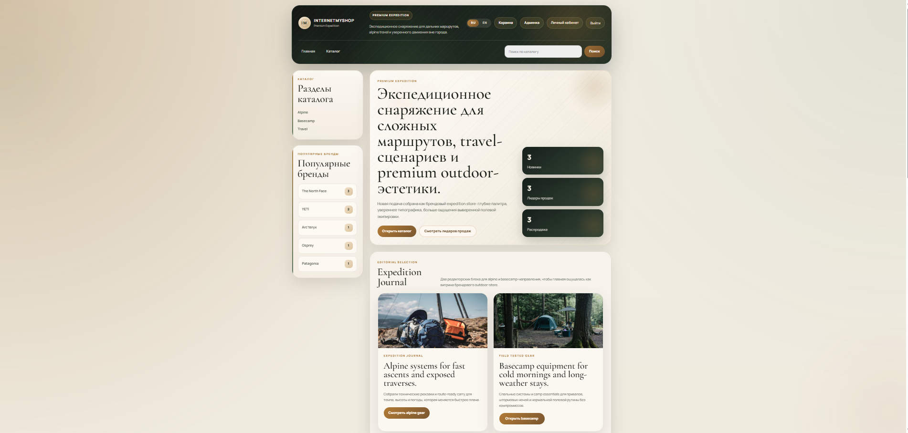
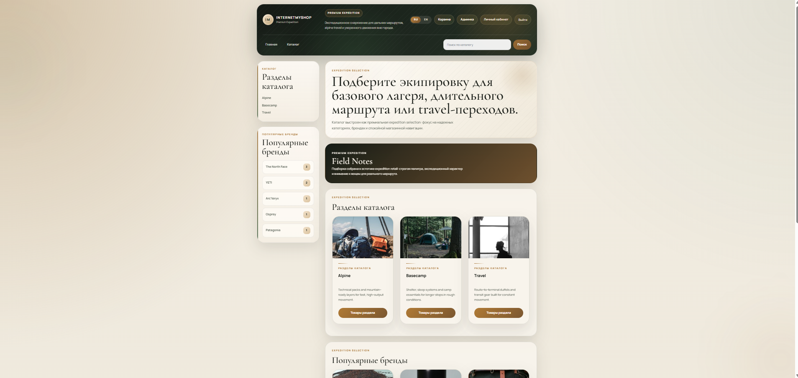
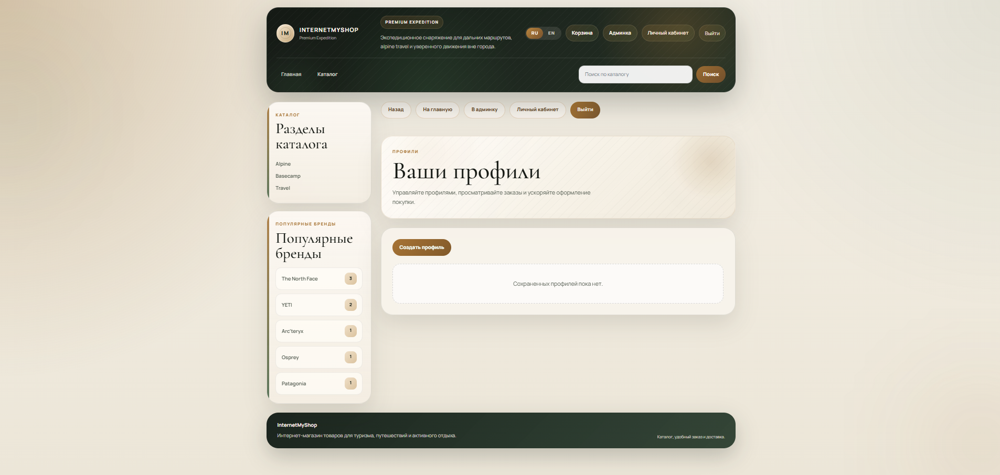
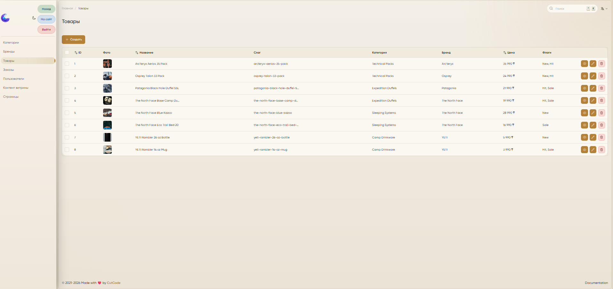

# internetMyShop

`internetMyShop` — интернет-магазин с Laravel backend, Blade storefront, отдельным Nuxt frontend и админ-панелью на MoonShine.

Проект находится в контролируемом переходе от legacy Blade-витрины к API-first архитектуре:

- Laravel остаётся единственным источником истины для бизнес-логики;
- legacy Blade storefront продолжает работать;
- Nuxt 4 frontend в `apps/web` уже использует `BFF`-слой и `api/v1`;
- админка переведена на `MoonShine`;
- тексты витрины можно управлять из админки через ресурс `Контент витрины`.

## Что есть в проекте

### Публичная часть

- главная витрина и каталог товаров;
- страницы категорий, брендов и товаров;
- поиск по каталогу;
- корзина и checkout;
- регистрация, вход, личный кабинет, профили доставки и история заказов;
- двуязычный интерфейс `RU / EN`.

### Админка

- `MoonShine` под `/admin`;
- управление категориями, брендами, товарами, заказами, страницами и пользователями;
- управление текстами витрины через отдельный CRUD ресурс;
- загрузка изображений для каталога.

### API

- versioned REST API под `/api/v1`;
- Sanctum token auth для внешних клиентов;
- guest-friendly basket и checkout;
- payment initiation, payment status endpoint, hosted card checkout config и provider webhooks;
- OpenAPI спецификация в `docs/openapi.yaml`;
- Swagger UI под `/swagger` в non-production окружениях.

## Скриншоты

<table>
  <tr>
    <td width="50%">
      <a href="docs/creenshots/main.png" target="_blank" rel="noopener noreferrer">
        
      </a>
      <p>
        <a href="docs/creenshots/main.png" target="_blank" rel="noopener noreferrer">
          <strong>Главная витрина</strong>
        </a>
      </p>
    </td>
    <td width="50%">
      <a href="docs/creenshots/catalog.png" target="_blank" rel="noopener noreferrer">
        
      </a>
      <p>
        <a href="docs/creenshots/catalog.png" target="_blank" rel="noopener noreferrer">
          <strong>Каталог товаров</strong>
        </a>
      </p>
    </td>
  </tr>
  <tr>
    <td width="50%">
      <a href="docs/creenshots/cabinet.png" target="_blank" rel="noopener noreferrer">
        
      </a>
      <p>
        <a href="docs/creenshots/cabinet.png" target="_blank" rel="noopener noreferrer">
          <strong>Личный кабинет</strong>
        </a>
      </p>
    </td>
    <td width="50%">
      <a href="docs/creenshots/admin_cab.png" target="_blank" rel="noopener noreferrer">
        
      </a>
      <p>
        <a href="docs/creenshots/admin_cab.png" target="_blank" rel="noopener noreferrer">
          <strong>MoonShine админка</strong>
        </a>
      </p>
    </td>
  </tr>
</table>

## Технологический стек

### Backend

- `PHP 8.4`
- `Laravel 12`
- `Laravel Sanctum`
- `MoonShine 4`
- `Intervention Image`
- `SQLite` для локальной разработки
- `MySQL 8` для Docker и production-like среды

### Frontend

- `Nuxt 4`
- `Vue 3`
- `TypeScript`
- `Nitro`
- `Vitest`
- `Playwright`

### Инфраструктура и quality

- `Docker Compose` для dev-окружения
- `PHPUnit`
- `Larastan / PHPStan`
- `Laravel Pint`
- `ESLint`

## Архитектура

```text
Browser
  -> Laravel Blade storefront
      -> Controllers / Domain / Models / Policies / Actions
      -> sqlite locally or MySQL in Docker

Browser
  -> Nuxt 4 frontend in apps/web
      -> Nuxt BFF (/bff)
          -> Laravel API /api/v1
          -> Sanctum token kept behind HttpOnly cookie boundary

Admin
  -> MoonShine /admin
      -> same Laravel app
      -> same database
      -> CRUD for catalog, orders, users, pages, storefront content
```

### Ключевые архитектурные правила

- backend определяет бизнес-правила, сумму заказа, ownership и роли;
- денежные суммы и конвертация считаются через общий слой `app/Support/Money`, а не через `float`;
- Blade storefront остаётся совместимым web-слоем;
- Nuxt frontend не должен хранить bearer token в JavaScript-доступном состоянии;
- браузерный frontend ходит в backend через Nuxt BFF;
- админка и витрина работают поверх одной доменной модели;
- тексты витрины имеют file-based fallback и DB override через `site_contents`.

### Платёжная интеграция

Платёжный слой построен так, чтобы sandbox-провайдер можно было заменить на production-провайдера без переписывания checkout целиком.

Ключевые backend точки:

- `app/Contracts/Payments/PaymentProviderDriver.php`
- `app/Services/Payments/PaymentManager.php`
- `app/Services/Payments/PaymentService.php`
- `app/Support/Money/Money.php`
- `app/Support/Money/Currency.php`
- `config/payments.php`

Текущий набор провайдеров:

- `paypal` — sandbox hosted card fields;
- `fake` — полностью локальный provider для tests/e2e.

Текущий flow подключения и замены провайдера описан в этом README.

## Безопасность

В проекте уже зафиксированы следующие базовые гарантии:

- аутентификация API работает через `Sanctum`;
- browser auth у Nuxt реализован через `HttpOnly` cookie и BFF;
- роли и доступ в админку централизованы через `Gate access-admin`;
- ownership профилей и заказов защищён `Policies`;
- checkout не доверяет клиентским `amount`, `status`, `user_id`;
- корзина использует зашифрованную cookie;
- upload-пути проходят через backend-валидацию;
- для web-ответов выставляются security headers и CSP;
- OpenAPI spec проверяется тестом на соответствие зарегистрированным API routes.

Подробности по архитектуре и платёжному flow собраны в разделах `Архитектура` и `Платёжная интеграция` этого README.

Текущий dev/test провайдер по умолчанию: `PayPal Sandbox`. Он используется для hosted card fields sandbox-flow. Витрина магазина живёт в `KZT`, поэтому sandbox-списание может идти в `USD` через backend conversion rate.

## Структура репозитория

```text
app/                    Laravel application code
  Actions/              write-side business actions
  Domain/               queries, filters, policies and module logic
  Http/                 controllers, requests, middleware, resources
  Models/               Eloquent models
  MoonShine/            admin panel resources, pages and layout
  Services/             application services
  Support/              defaults, exact money math and support classes

apps/web/               separate Nuxt frontend
  components/           reusable UI
  composables/          frontend state and API helpers
  pages/                route-level pages
  server/               Nuxt BFF routes and backend proxy
  tests/                Vitest and Playwright tests

database/               migrations, factories, seeders
docker/                 Docker development runtime files
docs/                   OpenAPI spec and project screenshots
public/                 web root and compiled assets
resources/              Blade templates, translations, source assets
routes/                 web and API routes
tests/                  Laravel feature and unit tests
```

## Быстрый запуск локально

Основной кроссплатформенный способ запуска и проверки проекта:

```bash
php scripts/app.php <command>
```

Этот launcher одинаково работает на `Windows`, `Ubuntu` и `macOS`.

Он нужен для двух вещей:

- у команды один и тот же набор команд на всех ОС;
- проект не зависит от сломанной внешней обёртки `composer`, если она есть в системе.

Минимальные требования:

- `php`
- `node`
- `npm`
- `docker` для Docker-команд

Если в `PATH` лежит не тот PHP, launcher пытается сам найти `PHP 8.4`.
При необходимости можно явно указать runtime через переменную окружения:

```bash
PROJECT_PHP_BIN=/path/to/php8.4
```

Windows PowerShell:

```powershell
$env:PROJECT_PHP_BIN='C:\OSPanel\modules\PHP-8.4\php.exe'
```

На `Windows + OSPanel` launcher дополнительно подставляет проектный temp-dir для `PHP 8.4`, чтобы `artisan test`, загрузки файлов и `composer`-запуски не упирались в системный временный каталог панели.

`composer app:*` и `npm run web:*` остаются допустимыми алиасами, если локальный `composer` установлен и исправно работает.

### 1. Установить зависимости

```bash
php scripts/app.php deps:install
```

### 2. Подготовить локальное окружение backend

```bash
php scripts/app.php local:prepare
php scripts/app.php local:setup
```

Эти команды:

- создают `.env` из `.env.example`, если файла ещё нет;
- создают `database/database.sqlite`, если файла ещё нет;
- генерируют `APP_KEY`;
- выполняют миграции;
- заливают demo seed;
- создают `storage` link.

### 3. Запустить Laravel storefront и админку

```bash
php scripts/app.php local:serve
```

Основные адреса локального backend:

- Blade storefront: `http://localhost:8000`
- admin MoonShine: `http://localhost:8000/admin`
- Swagger UI: `http://localhost:8000/swagger`
- OpenAPI spec: `http://localhost:8000/swagger/openapi.yaml`

### 4. Запустить отдельный Nuxt frontend

```bash
php scripts/app.php web:dev
```

Адрес Nuxt frontend:

- `http://localhost:3000`

Если нужно переопределить backend API для Nuxt, создайте `apps/web/.env`:

```dotenv
NUXT_BACKEND_API_BASE=http://localhost:8000/api/v1
```

## Быстрый запуск в Docker

Текущий `docker-compose.yml` предназначен для разработки, а не для production.

Почему:

- backend контейнер запускает `php artisan serve`;
- frontend контейнер запускает `nuxt dev`;
- это удобно для dev, но не является production-grade runtime.

### Поднять dev-стек

```bash
php scripts/app.php docker:up
```

### Логи backend

```bash
php scripts/app.php docker:logs
```

### Полезные Docker-команды

```bash
php scripts/app.php docker:migrate
php scripts/app.php docker:seed
php scripts/app.php docker:seed:content
php scripts/app.php docker:refresh
php scripts/app.php docker:down
```

Docker endpoints:

- Laravel / Blade / admin: `http://localhost:8080`
- Nuxt frontend: `http://localhost:3001`
- Swagger UI: `http://localhost:8080/swagger`
- Docker MySQL: `127.0.0.1:3307`

Для backend используйте именно `localhost:8080`, а не `127.0.0.1:8080`, потому что в приложении включена проверка доверенных host-имен.

## Seeders и demo-данные

### Demo аккаунты

- admin: `admin@example.test` / `Password123!`
- user: `user@example.test` / `Password123!`

### Что создаёт полный demo seed

- admin пользователя;
- demo покупателя;
- категории и бренды;
- товары;
- профиль доставки для demo user;
- базовые DB-записи контента витрины.

### Полный сброс локальной базы с demo-данными

```bash
php scripts/app.php local:refresh
```

### Только заполнить или синхронизировать контент витрины

```bash
php scripts/app.php local:seed:content
php scripts/app.php docker:seed:content
```

Важно:

- полный demo seed подходит для local и staging;
- для production не используйте `migrate:fresh --seed`, если не хотите потерять данные;
- для production контента витрины используйте только `StorefrontSiteContentSeeder` или ручное управление через MoonShine.

## Тесты и quality gates

### Backend

```bash
php scripts/app.php backend:lint
php scripts/app.php backend:analyse
php scripts/app.php backend:test
php scripts/app.php backend:quality
```

### Frontend

```bash
php scripts/app.php web:lint
php scripts/app.php web:typecheck
php scripts/app.php web:test:unit
php scripts/app.php web:build
php scripts/app.php web:quality
```

### E2E

```bash
php scripts/app.php web:test:e2e:install
php scripts/app.php web:test:e2e
```

### Быстрая полная проверка проекта на любой ОС

```bash
php scripts/app.php doctor
php scripts/app.php verify:all
php scripts/app.php verify:e2e
```

Если на Windows `PHP 8.4` не лежит в `PATH`, для Playwright можно задать:

```bash
PLAYWRIGHT_PHP_BINARY=C:\OSPanel\modules\PHP-8.4\php.exe
```

### Что проверяют тесты

- auth API;
- catalog API;
- documented catalog filters for category and brand endpoints;
- basket API;
- basket clear, empty checkout and exact decimal basket totals;
- checkout safety rules;
- payment create / checkout-config / capture / webhook flow;
- payment status page, provider return and provider cancel web-flow;
- profile and order ownership;
- profile API CRUD through `GET / POST / PUT / DELETE`;
- MoonShine admin access;
- MoonShine catalog image upload on Windows-friendly fixture path;
- storefront content overrides;
- public storefront pages and authenticated account pages;
- Swagger route availability;
- OpenAPI route + HTTP method contract;
- Nuxt unit logic;
- Playwright сценарий `login -> basket -> checkout`.

## Troubleshooting on Windows / OSPanel

Если в PowerShell появляется ошибка:

```text
Could not open input file: \composer.phar
```

значит shell взял не нормальный Composer, а сломанную системную обёртку вроде `C:\OSPanel\modules\PHP-8.2\composer.bat`.

Для проекта это больше не блокер. Используйте команды:

```bash
php scripts/app.php doctor
php scripts/app.php local:setup
php scripts/app.php docker:logs
php scripts/app.php verify:all
```

Команда `doctor` покажет, какие `PHP`, `Composer`, `NPM` и `Docker` launcher нашёл на конкретной машине.

На Windows это нормально, если `doctor` показывает разные значения для `Launcher PHP` и `Project PHP`: например, launcher может стартовать из `PHP 8.2`, а проектовые команды и тесты уже выполнять через найденный `PHP 8.4`.

Если автоопределение не сработало, укажите:

```powershell
$env:PROJECT_PHP_BIN='C:\OSPanel\modules\PHP-8.4\php.exe'
```

Если в Docker на `http://localhost:8080` у админки появляются `419 Page Expired` или странные редиректы на login, проверьте `SESSION_DOMAIN`:

```dotenv
SESSION_DOMAIN=
```

Для локального `localhost` его нужно оставлять пустым. Значение вроде `SESSION_DOMAIN=localhost` даёт нестабильные cookie в браузерах.

## Документация проекта

### Основные документы

- [README.md](README.md) — быстрый вход, стек, запуск, тесты;
- [docs/openapi.yaml](docs/openapi.yaml) — API контракт;
- [CONTRIBUTING.md](CONTRIBUTING.md) — правила инженерной работы.

### Обязательное правило сопровождения

После каждого meaningful изменения в проекте нужно обновлять связанные документы в том же коммите или PR.

Минимум:

- `README.md` — если изменился запуск, окружение, runtime, seed, workflow, архитектурные границы или платёжный flow;
- `docs/openapi.yaml` — если изменились API routes, payloads или auth requirements;
- `CONTRIBUTING.md` — если изменились инженерные правила или договорённости по процессу.

## Развёртывание на хостинге

Кратко:

- рекомендуемый production-вариант: `Ubuntu VPS + Nginx + PHP-FPM 8.4 + MySQL 8 + Node 24 + systemd`;
- допустимый staging/dev-вариант: текущий Docker stack;
- shared hosting без постоянного Node process подходит только для Blade storefront и MoonShine, но не для полноценного Nuxt runtime.

## Лицензия и владелец

Проект лицензирован как проприетарный.

- владелец: `Rinat Sarmuldin`
- контакт: `ura07srr@gmail.com`
- файл лицензии: `LICENSE.md`

Если файл, библиотека, иконка, шрифт или зависимость имеют свою лицензию, действует лицензия соответствующего third-party компонента.
